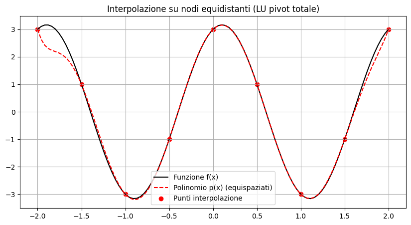
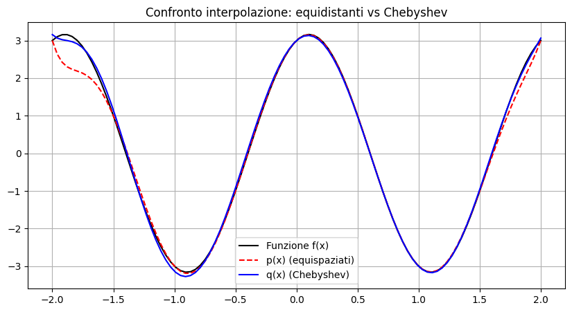

# Calcolo Numerico 📐

### Notebook universitario - Esame di **Calcolo Numerico**

**Corso di Laurea in Informatica e Tecnologie per la Produzione del Software**  
Università degli Studi di Bari Aldo Moro  
**Data esame: 10 febbraio 2026**

---

## 📌 Descrizione

Questo repository raccoglie il notebook sviluppato per l'esame di **Calcolo Numerico**.

L'elaborato affronta un problema di interpolazione polinomiale e analisi numerica utilizzando **Python**, **NumPy**, **SciPy** e **Matplotlib**.

La funzione studiata è:

```text
f(x) = sin(πx) + 3 cos(πx)
```

nell'intervallo:

```text
[-2, 2]
```

con **9 nodi di interpolazione** e polinomi di grado **8**.

---

## 🧮 Argomenti trattati

Il notebook comprende:

- costruzione della **matrice di Vandermonde**;
- implementazione della fattorizzazione **LU con pivot totale**;
- risoluzione di sistemi lineari triangolari;
- interpolazione su **nodi equidistanti**;
- interpolazione su **nodi di Chebyshev**;
- confronto grafico tra i due interpolanti;
- analisi del **condizionamento** delle matrici;
- studio del **residuo relativo**;
- confronto dell'**errore massimo di interpolazione**;
- calcolo di **autovalori e autovettori**;
- costruzione di un polinomio a partire dai moduli degli autovalori;
- applicazione del **metodo di Newton**;
- confronto tra tre criteri di arresto:
  - step assoluto;
  - residuo;
  - step relativo.

---

## 🛠️ Tecnologie utilizzate


---

## 📊 Interpolazione su nodi equidistanti

Il primo interpolante viene costruito su 9 nodi equidistanti mediante una matrice di Vandermonde e una fattorizzazione LU con pivot totale.



---

## 📈 Confronto con i nodi di Chebyshev

Successivamente viene costruito un secondo interpolante utilizzando i nodi di Chebyshev.



Dai risultati del notebook emerge un miglioramento sia del condizionamento sia dell'errore massimo utilizzando i nodi di Chebyshev.

| Grandezza | Nodi equidistanti | Nodi di Chebyshev |
|---|---:|---:|
| Condizionamento Vandermonde | `1.16e+04` | `5.33e+03` |
| Errore massimo | `8.73e-01` | `1.58e-01` |

Il residuo relativo del sistema con nodi equidistanti risulta circa:

```text
2.07e-15
```

---

## 🔢 Autovalori e metodo di Newton

Il notebook calcola gli autovalori della matrice di Vandermonde costruita sui nodi di Chebyshev e utilizza i loro moduli come radici di un nuovo polinomio.

Per il metodo di Newton viene scelta come radice target:

```text
188.647688
```

con punto iniziale:

```text
x0 = 207.512457
```

Risultati dei criteri di arresto:

| Criterio | Iterazioni | Soluzione |
|---|---:|---:|
| Step assoluto | 7 | `188.647688` |
| Residuo | 6 | `188.647688` |
| Step relativo | 7 | `188.647688` |

---

## 📂 Struttura del repository

```text
Calcolo-Numerico/
├── notebooks/
│   └── Esame_Calcolo_Numerico.ipynb
├── docs/
│   └── Esame_Calcolo_Numerico.pdf
├── assets/
│   ├── interpolazione_nodi_equidistanti.png
│   └── confronto_equidistanti_chebyshev.png
├── requirements.txt
├── .gitignore
└── README.md
```

---

## 🚀 Come eseguire il notebook

### Requisiti

- Python 3
- Jupyter Notebook o JupyterLab

### Installazione delle dipendenze

```bash
pip install -r requirements.txt
```

### Avvio

```bash
jupyter notebook notebooks/Esame_Calcolo_Numerico.ipynb
```

Il notebook può essere aperto anche direttamente con **Visual Studio Code** tramite l'estensione Jupyter.

---

## 📚 Documentazione

È disponibile anche l'esportazione PDF del notebook:

➡️ [`docs/Esame_Calcolo_Numerico.pdf`](docs/Esame_Calcolo_Numerico.pdf)

---

## 🎓 Contesto accademico

**Esame:** Calcolo Numerico  
**Studentessa:** Sonia Auciello  
**Data:** 10/02/2026  
**Corso di Laurea:** Informatica e Tecnologie per la Produzione del Software  
**Università:** Università degli Studi di Bari Aldo Moro

---

## ℹ️ Note

Il repository è una versione pubblica del materiale d'esame.  
L'indirizzo e-mail universitario è stato rimosso dalla versione destinata al portfolio GitHub.
